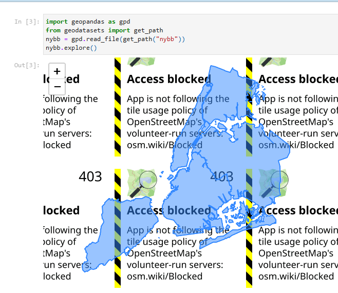

Somewhat recently OSM enforced changes to their [tile access policy](https://wiki.openstreetmap.org/wiki/Blocked_tiles).
This is fair enough, this is a free service provided to the benefit of everyone, yet hosting tiles is not free.
However, for tools which aren't compliant, this results in tiles being completely blocked, making interactive maps
significantly less useful:



<!--  -->

This example happens when you use [nbconvert](https://github.com/jupyter/nbconvert) to export
a jupyter notebook to HTML when it contains a [folium](https://github.com/python-visualization/folium) map -
in this case produced with [geopandas](https://github.com/geopandas/geopandas).

I recently discovered the issue when reviewing a validation pipeline where the historical outputs from last year
worked fine at the time, but reviewing them nowadays they no longer work. Until folium is able to resolve
some version of [this issue](https://github.com/python-visualization/folium/issues/2215) the simple solution is
to use something like `python -m http.server` to serve the html and use that to view it. This works, but
is not super convenient - relative paths, and it doesn't just open automatically.

Instead, I've got a simple script, to slightly improve the ergonomics:

```python
# /// script
# requires-python = ">=3.10"
# dependencies = []
# ///

"""Show HTML files containing broken OSM tiles, without rerunning any code.

This is a workaround of https://github.com/python-visualization/folium/issues/2215 
which still doesn't have a direct solution

Usage: uv run serve_html.py "<absolute_path_to_map_file.html>"
"""

import functools
import http.server
from pathlib import Path
import socketserver
import sys
import webbrowser

if len(sys.argv) < 2:
    print("Usage: python serve_html.py /absolute/path/to/file.html")
    sys.exit(1)

target = Path(sys.argv[1]).expanduser().resolve()
handler = functools.partial(http.server.SimpleHTTPRequestHandler, directory=str(target.parent))

with socketserver.TCPServer(("127.0.0.1", 0), handler) as httpd:
    port = httpd.server_address[1]
    url = f"http://127.0.0.1:{port}/{target.name}"
    webbrowser.open(url)
    print(f"Serving at {url} (Ctrl+C to stop)")
    try:
        httpd.serve_forever()
    except KeyboardInterrupt:
        pass
```

I suppose I could package this into something you could invoke directly with `uv`, but I'd rather hope and upstream
solution is available sooner than later!