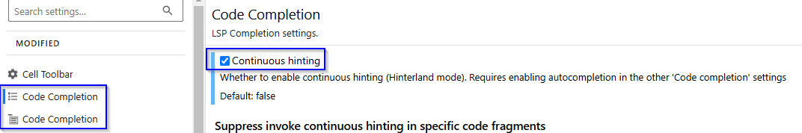
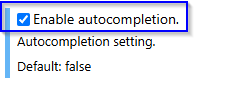

Periodically I find myself switching back and forth between different and editors and workflows to try and be the most
productive, depending on what kind of work I'm doing. Usually when in python, that involves some variation of writing
python libraries / modules and exploratory development in jupyter notebooks of some kind. The goal is to try and 
minimise the friction encountered working between different sources. These are the combinations I've tried over the
last couple of years:
- Jupyterlab for notebooks, pycharm for python files
- Pycharm Pro for both
- Jupyterlab for running notebooks, paired with jupytext python files for refactoring in pycharm
- VSCode + Jupyterlab
- VSCode + inbuild notebook support

In principle pycharm pro should have been great, as allowing go to definition + navigating back and forth across
notebooks and scripts is super convenient, but it's always been not quite as fluid as it should be. 
The remote development support also is still maturing, even after several years of beta support.

I then switched to VSCode for remote development and in general quite like working with it. However,
I seem to be fighting it more often than I should be to have all the features I want. The way that the plugins are configured
I always seem to be at ~80% of what I want working, even though I manage my vscode setting through dotfiles. Right now,
I've finally gotten notebook code formatting via black working, but I'm missing documentation previews on methods,
which means I have to interrupt my workflow to go look up api documentation to work out what that parameter was called.
At the moment it also doesn't seem to be coping super well with virtualenv discovery, now that [uv](https://github.com/astral-sh/uv)
has made virtualenvs super cheap and easy.

So I've come full circle and am now trying out jupyterlab some more again - but with the workflow extensions it needs to
be competitive. I remember back first using jupyter notebooks and seeking out the [hinterland plugin](https://jupyter-contrib-nbextensions.readthedocs.io/en/latest/nbextensions/hinterland/README.html) for automatic autocomplete. I've checked in with
the jupyterlab equivalents via the jupyter language server a few times over the years - I used the jedi language server
a lot back in 2022 but this is my first recent foray into what coming up with a good setup looks like. These notes
are all made after a quick morning of experimenting, but I expect I'll come back to update them over time.

```bash
uv init
# set up the rest of your environment with uv
uv add jupyterlab-lsp python-lsp-server python-lsp-ruff jupytext jupyterlab-code-formatter ruff
uv run jupyter lab
```
Now in the jupyterlab settings menu (settings -> settings editor -> json settings editor)
- In both code completion tabs (two different icons) enable continuous hinting/ autocompletion:




<!--  -->

- In the jupyterlab code formatter, paste something like this:
```jsonc
{
  "formatOnSave": true,
  "preferences": {
        "default_formatter": {
            "python": "ruffformat",
            "R": "styler"
        }
    },
    // Command line options to be passed to ruff format.
    "ruffformat": {
        "args": ["--line-length", "120"]
    },
    
}
```
- In the keyboard shortcuts section, add something like this to the shortcuts list:
```jsonc
,
        {
          "command": "jupyterlab_code_formatter:format",
          "keys": [
            "Ctrl M",
            "B"
          ],
          "selector": ".jp-Notebook.jp-mod-editMode"
        }
```
This binds "format this cell" to the chord Ctrl M + B.

There's also a circle icon to the right of the cell type which will format the whole notebook:


