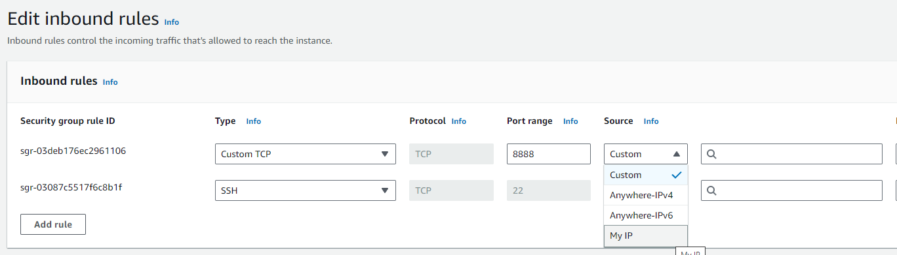

To SSH into instances on AWS (or generally do anything where the internet needs to talk to the instance) one needs to 
set up *inbound rules* within a security group attached to an instance. For SSH, generally I only want to whitelist
a single IP address - my own. Today I learnt that AWS can automatically set your IP:

By selecting "My IP" from the "Source" dropdown. At first I was a bit worried this was a little bit too clever and might
start updating records whenever I log into AWS - but fortunately not - it's just to populate the IP on this screen. If
you have a dynamic IP address, you may still need to come in and update this periodically (but that's better than 
spooky action at a distance in my view).

